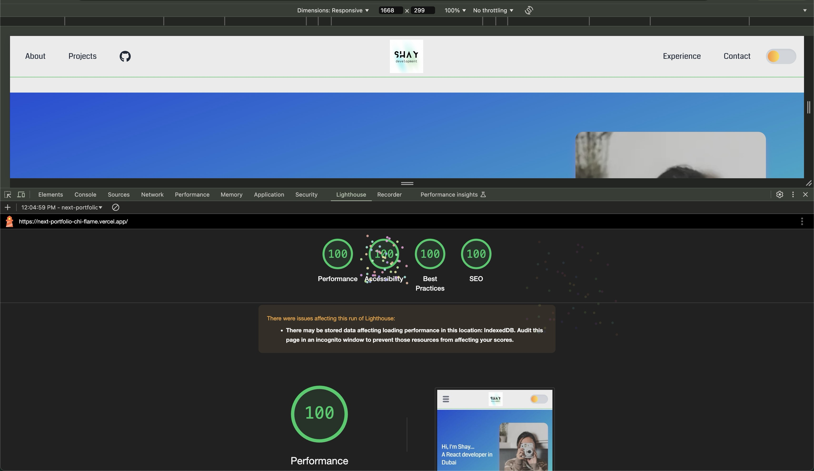

# **Project Name**: Portfolio Website

This is a dynamic, responsive portfolio website showcasing my skills, projects, and experience. Built with modern web technologies, it provides an engaging user experience for potential employers, collaborators, and visitors.



---

## **Features**

- **Responsive Design:** Fully optimized for desktops, tablets, and mobile devices.
- **Dark Mode Toggle:** Seamless switching between light and dark themes.
- **Dynamic Components:** Modular and reusable components for scalability.
- **Mobile-Friendly Navigation:** Hamburger menu with smooth transitions.
- **Highlight Projects:** Showcasing notable projects with descriptions and links.
- **GitHub Integration:** Quick access to my GitHub profile.
- **Contact Form:** Easy way for visitors to get in touch.
- **Performance Optimizations:** Prioritized assets and minimal render blocking.

---

## **Technologies Used**

- **Next.js**: React-based framework for server-side rendering and static site generation.
- **TypeScript**: For type safety and scalability.
- **TailwindCSS**: Utility-first CSS framework for responsive designs.
- **React Icons**: Scalable icons for navigation and links.
- **Framer Motion**: For seamless animations.
- **EmailJs**: Contact form submission.

---

## **Setup Instructions**

1. Clone the repository:

   ```bash
   git clone https://github.com/shay122990/next-portfolio
   cd next-portfolio
   ```

2. Install dependencies:

   ```bash
   npm install
   ```

3. Run the development server:

   ```bash
   npm run dev
   ```

4. Open your browser and visit:

   ```
   http://localhost:3000
   ```

5. To build for production:
   ```bash
   npm run build
   npm run start
   ```

---

## **Components Overview**

- **Navbar**:

  - Dynamic navigation links.
  - Dark mode toggle.
  - Mobile and desktop layouts.

- **Hero Section**:

  - Welcoming introduction with animation.

- **Projects Section**:

  - List of featured projects with descriptions and links.

- **Contact Form**:
  - Simple form for visitors to connect.
  - Integrated with EmailJS for email submissions.

---

## **How to Contribute**

1. Fork the repository.
2. Create a new branch:
   ```bash
   git checkout -b feature-name
   ```
3. Make changes and commit:
   ```bash
   git commit -m "Added a new feature"
   ```
4. Push changes:
   ```bash
   git push origin feature-name
   ```
5. Submit a pull request.

---

## **Contact**

If you have any questions, suggestions, or would like to collaborate, feel free to reach out via the [contact page](#contact).

---
